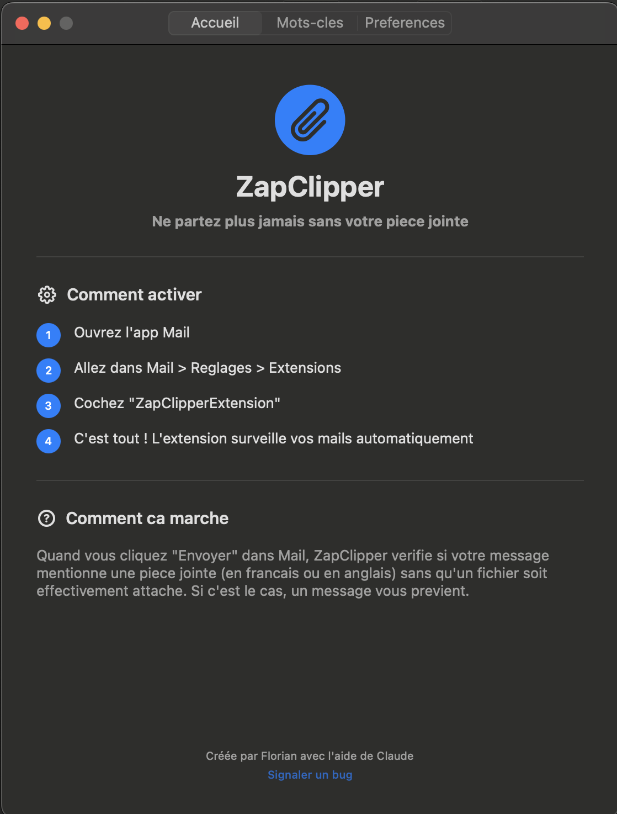
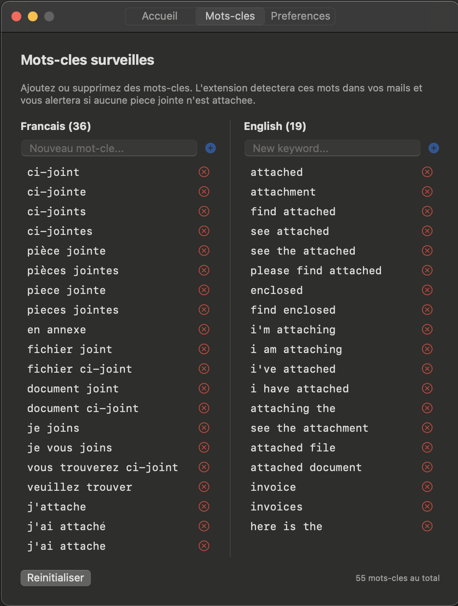
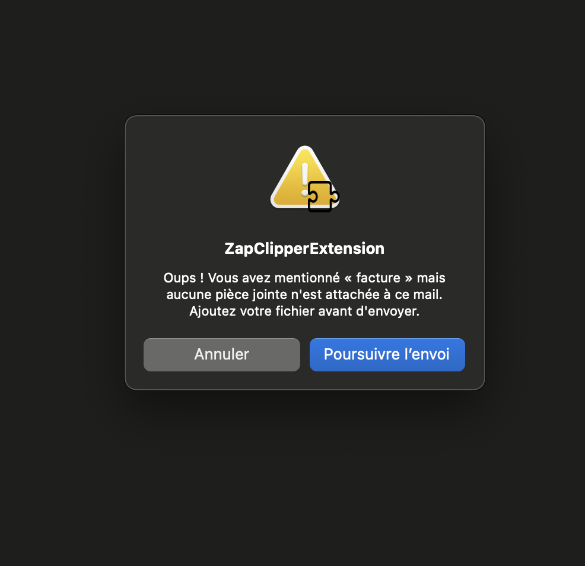

# ZapClipper

**Ne partez plus jamais sans votre piece jointe.**

ZapClipper est une extension Apple Mail pour macOS qui detecte quand vous mentionnez une piece jointe dans un email sans en avoir attache une — et vous previent avant l'envoi.

## Demo

[](https://www.youtube.com/shorts/1EWYjqluWoA)

## Screenshots

| Accueil | Mots-cles | Alerte |
|---------|-----------|--------|
|  |  |  |

## Fonctionnalites

- Detection bilingue (francais & anglais) des mots-cles d'attachement
- Mots-cles personnalisables depuis l'app
- Ignore les messages cites dans les fils de reponse (pas de faux positifs)
- Mises a jour automatiques via Sparkle

## Installation

1. Telecharger la derniere version depuis les [Releases](https://github.com/Lenouw/ZapClipper/releases)
2. Dezipper et copier `ZapClipper.app` dans `/Applications`
3. Lancer l'app une fois
4. Ouvrir **Mail > Reglages > Extensions** et cocher **ZapClipperExtension**
5. C'est tout !

## Build from source

```bash
# Prerequis : Xcode 16+, XcodeGen
xcodegen generate
open ZapClipper.xcodeproj
# Build & Run (scheme ZapClipper)
```

## Licence

MIT
